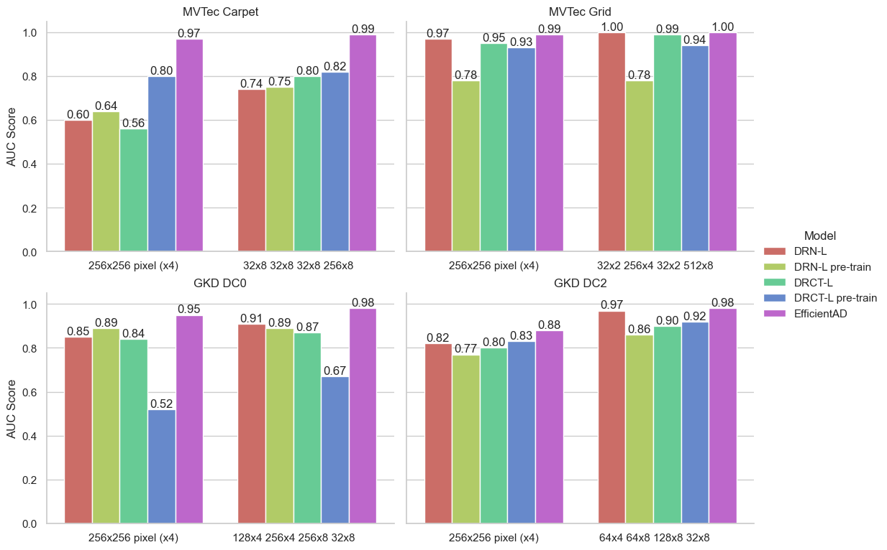

# Industrial Anomaly Detection Using Transformer-Based Super-Resolution

[](https://www.python.org/downloads/)
[](https://opensource.org/licenses/MIT)

An investigation into the novel application of Super-Resolution (SR) models, including a Transformer-based architecture, for unsupervised anomaly detection on industrial manufacturing data.

---

## 🎯 Abstract

In industrial manufacturing, reliably detecting visual anomalies is critical for quality control, but state-of-the-art methods often require extensive labeled data. This project introduces a novel, unsupervised approach by repurposing Super-Resolution (SR) models for anomaly detection. The core hypothesis is that models trained exclusively on anomaly-free images will fail to accurately reconstruct anomalous regions. By training two advanced SR models (DRN and the Transformer-based DRCT) on the MVTec AD and GKD datasets, this thesis measures the reconstruction error to distinguish between normal and defective samples. While the specialized EfficientAD model showed more robust overall performance, the SR-based approach achieved comparable, and in some cases near-equal, performance, validating its potential as a viable alternative for specific industrial use cases.

## ✨ Key Features & Skills Demonstrated

*   **Technologies:** Python, PyTorch, Pandas, Scikit-learn, Matplotlib, JupyterLab
*   **Infrastructure:** **NVIDIA H100 GPUs, Slurm Workload Manager, Bash Scripting**
*   **Concepts:** Deep Learning, Unsupervised Learning, Anomaly Detection, **Computer Vision**, **Generative Models**, Super-Resolution, Transformers, High-Performance Computing (HPC)

## 📊 Key Result

The chart below compares the anomaly detection performance (AUC Score) of the proposed Super-Resolution models (DRN-L, DRCT-L) against the state-of-the-art EfficientAD model across various industrial datasets and image configurations.



*Caption: The SR-based models demonstrate competitive performance against a specialized anomaly detection model, particularly on the MVTec Carpet dataset, validating the core hypothesis that reconstruction error can serve as an effective proxy for anomaly detection.*

---

## 🚀 Getting Started

These instructions will get you a copy of the project up and running on your local machine for development and testing purposes.

### Prerequisites

*   Python 3.9+
*   NVIDIA GPU with CUDA support is recommended for model training.

### Installation

1.  **Clone the repository:**
    ```bash
    git clone https://github.com/your-username/your-repo-name.git
    cd your-repo-name
    ```

2.  **Create and activate a virtual environment:**
    ```bash
    python3 -m venv venv
    source venv/bin/activate
    ```

3.  **Install the project in editable mode with its dependencies:**
    ```bash
    pip install -e .
    pip install -r requirements.txt
    ```

4.  **Download the data:**
    *   The **MVTec AD** dataset can be downloaded from its [official website](https://www.mvtec.com/company/research/datasets/mvtec-ad). This project uses the `carpet` and `grid` classes.
    *   The **GKD** dataset is a private industrial dataset. This project uses the `dc0` and `dc2` classes.
    *   Please place the data into the `data/` directory following the expected structure.

### Usage

**Model Training:**

The main training script `main.py` was designed to be run on an HPC cluster managed by Slurm.

To launch a training job on a Slurm cluster, use the provided script:
```bash
sbatch slurm_script.sh

For local execution (if you have a suitable GPU), you can run the Python script directly:

python src/main.py

### Evaluation and Analysis:

Analysis of model outputs and the generation of test images were performed using the Jupyter notebooks located in the notebooks/ folder.

📂 Repository Structure
.
├── data/                 # Placeholder for datasets (MVTec AD, GKD)
│   └── README.md
├── notebooks/            # Jupyter notebooks for evaluation and visualization
│   └── anomaly-detection.ipynb
│   └── efficientAD.ipynb
│   └── test.ipynb
├── results/              # Placeholder for model outputs and figures
│   └── README.md
├── src/                  # Main source code for models, training, etc.
│   ├── __init__.py
│   └── main.py
│   └── checkpoint.py
│   └── data.py
│   └── drct.py
│   └── drn.py
│   └── efficientAD.py
│   └── helpers.py
│   └── loss.py
│   └── model.py
│   └── recall_1.py
│   └── trainer.py
├── slurm_script          # Slurm script for HPC job submission
│   └── slurm_script.sh
├── .gitignore
├── README.md
├── requirements.txt
└── setup.py

📄 License

This project is licensed under the MIT License.

🙏 Acknowledgments

This work was conducted as part of the Master's Thesis for the Information Systems Engineering program at University of Applied Sciences Aachen.
Special thanks to the authors of the DRN, DRCT, and EfficientAD papers.
